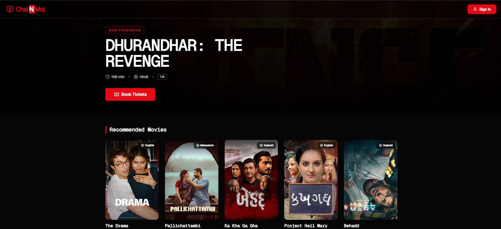
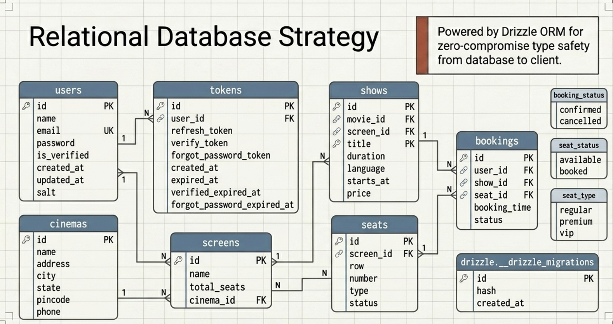

# Cinematic Movie Ticket Booking Backend

A robust, highly concurrent Node.js APIs for a cinematic movie ticket booking system. Built with **Express, TypeScript, PostgreSQL, and Drizzle ORM**, this backend manages movies, seat selections, and secure authentications.

---

## Screenshots

### Frontend


### Entity-Relationship (ER) Diagram


## Key Features

- **Concurrency Handling:** Employs advanced `FOR UPDATE` row-level database locking to handle high-concurrency seat assignments and prevent double-booking.
- **Secure Authentication:** Passwordless magic-link email verification flow natively implemented using **JWT** and **Nodemailer**.
- **Data Validation:** Strict runtime payload validation handled via **Zod**.
- **Modern ORM:** Type-safe SQL querying and migrations managed via **Drizzle ORM**.

## Tech Stack

- **Runtime Environment:** Node.js
- **Language:** TypeScript
- **Framework:** Express.js
- **Database:** PostgreSQL
- **ORM:** Drizzle ORM
- **Validation:** Zod
- **Authentication:** JSON Web Tokens (JWT)
- **Mailing:** Nodemailer

## 🛠 Prerequisites

Make sure you have the following installed:
- [Node.js](https://nodejs.org/) (v18+ recommended)
- [pnpm](https://pnpm.io/) (v10+ package manager)
- [Docker](https://www.docker.com/) (for spinning up the local PostgreSQL database)

## Getting Started

### 1. Clone the repository and install dependencies

```bash
git clone <your-repo-url>
cd movie-ticket-booking-backend
pnpm install
```

### 2. Environment Variables

Create `.env` and `.env-local` files in the root directory.

```dotenv
# Example .env configuration
```

### 3. Database Setup (Docker)

Quickly spin up the PostgreSQL instance using Docker container:

```bash
pnpm run up:db
```

Generate and push database schemas via Drizzle Kit:

```bash
npx drizzle-kit generate
npx drizzle-kit push
```
*(Alternatively, you can manage schema migrations as needed).*

### 4. Running the Application

**Development Mode:**
(Runs TypeScript in watch mode)
```bash
pnpm run dev
```

**Production Build:**
```bash
pnpm run build
pnpm run start
```

## 📁 Project Structure

```text
src/
├── app/          # App initialization and unified routing setup
├── config/       # Environment variables and core configurations
├── db/           # Drizzle ORM configurations and schemas
├── email/        # Nodemailer instances and email templates
├── middleware/   # Express middlewares (Auth, Error handling, etc.)
├── modules/      # Feature-based domains
│   ├── auth/     # Authentication logic & magic links
│   └── movies/   # Movie catalogs and highly-concurrent seat booking logic
├── utils/        # Shared helper functions
└── index.ts      # Main server entry point
```
